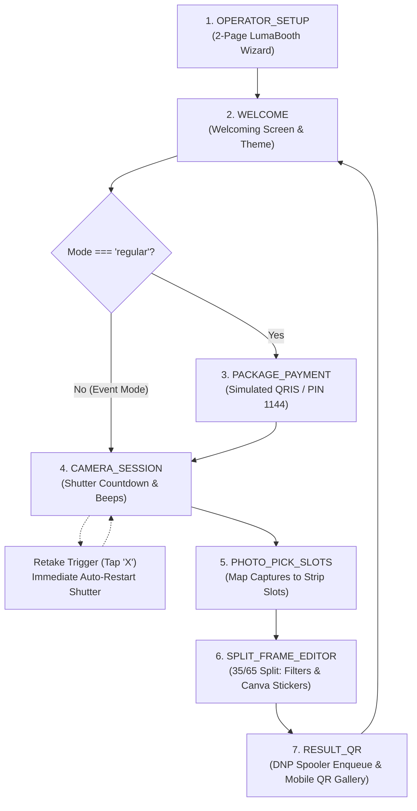

# CLAUDE.md — QuickPic Project Architecture & Operational Guide

Welcome to **QuickPic**! This document provides Claude and autonomous AI agents with a comprehensive mental model of the codebase, business domain, technical architecture, and engineering protocols.

---

## 🎯 1. Executive Summary & Vision

**QuickPic** is an intelligent, multi-tenant automated photobooth ecosystem built for photo entertainment vendors, event agencies, and retail venues managing fleets of physical photobooth kiosks.

- **Unified Fleet Operations:** A single vendor owner can configure, monitor, monetize, and remotely supervise multiple photobooth stations across various malls and venues from a unified dashboard.
- **Physical Kiosk First:** Designed to run on physical touchscreen kiosks (encapsulated via Electron) paired with real hardware: Canon DSLR cameras (via Canon EDSDK) and DNP dye-sublimation photo printers (DNP DS-RX1HS, QW410, Citizen CY-02).
- **Dual Operating Modes:**
  - **Event Mode:** Zero-paywall guest experience for private corporate events, weddings, and parties.
  - **Regular Mode:** Monetized retail experience with simulated QRIS payment and operator PIN bypass (`1144`).
- **Resilient Offline Architecture:** If venue Wi-Fi drops, kiosks buffer sessions and configuration locally in `LocalStorage` without interrupting paying customers.

---

## 🛠️ 2. Technology Stack

| Layer | Technologies | Key Details |
|---|---|---|
| **Core Framework** | Next.js 16 (App Router), React 19, TypeScript | Turbopack compilation, strict Server & Client Components. |
| **Styling & Icons** | Tailwind CSS v4, Lucide React | High-contrast dark theme kiosk aesthetic. |
| **Database & Auth** | Firebase (Auth, Firestore, Storage) | Relational multi-tenant schema with offline `LocalStorage` cache. |
| **Media CDN** | Cloudinary | Auto-optimized photo strip storage and instant public QR code URLs. |
| **Hardware Bridge** | Local Python Daemon (`hardware-daemon/app.py`) | Runs on port 8000; provides REST endpoints for Canon EDSDK and DNP spooling. |
| **Desktop Wrapper** | Electron | Fullscreen kiosk lock, native USB device access. |
| **Testing** | Node.js Test Runner (`--experimental-strip-types`) | 130+ unit tests for math, isolation, vouchers, and hardware. |
| **Code Intelligence** | Graphify (`graphify-out/graph.json`) | AST-level persistent codebase knowledge graph. |

---

## 🏛️ 3. Multi-Tenant Hierarchy & Database Schema

Data is organized hierarchically in Firestore and mirrored in local cache:

```
users/{userId} (Vendor Owner Account)
  └── outlets/{outletId} (Physical Venue / Store Branch, e.g. GI-01)
        └── events/{eventId} (Event Profiles, Branding, Custom Overlays)
              └── sessions/{sessionId} (Guest Captures, Strips, QR Links)
```

- **Firestore Collections:**
  - `users/{userId}`: User profile, role (`operator` / `owner`).
  - `users/{userId}/outlets/{outletId}`: Store/location records (name, venue address, branch code).
  - `users/{userId}/outlets/{outletId}/events/{eventId}`: Event configurations (event name, date, hashtag, strip footer text, operating mode, custom welcome screen images).
- **Offline Storage Keys:**
  - `quickpic_auth_user`: Active operator user session.
  - `quickpic_outlets_{userId}`: Cached list of outlets.
  - `quickpic_events_{userId}_{outletId}`: Cached list of events per outlet.
  - `quickpic_custom_templates`: User-uploaded custom PNG strip templates.

---

## 🔄 4. Kiosk State Machine Flow

The kiosk interface in [`src/app/page.tsx`](file:///Users/fikruhelmi/.gemini/antigravity/worktrees/Quickpic/daily_task_reporting/src/app/page.tsx) operates as a strict state machine:



### Key Interactive Features:
1. **Operator Setup Wizard ([`OperatorSetupWizard.tsx`](file:///Users/fikruhelmi/.gemini/antigravity/worktrees/Quickpic/daily_task_reporting/src/components/ux/OperatorSetupWizard.tsx)):**
   - **Page 1:** Outlet selector dropdown (with **Edit** and **Delete** modals), Event profiles tray with auto-scroll, Operating mode toggle, Capture capabilities (Photo, GIF, Boomerang, Video), Welcoming themes.
   - **Page 2:** Single dropdown for strip templates with **Upload Custom Template** pinned at the bottom, canvas preview with slot snapping (10px threshold) and guide lines, camera device selector, pose & review timers, and **USB Photo Printer Setup modal** (probing DNP spooler, cuts remaining, test prints).
2. **Retake Auto-Start:** Tapping `X` on any captured photo slot immediately clears that photo and automatically restarts the countdown sequence for the earliest empty slot.
3. **Uneven Split-Screen Editor ([`SplitScreenFrameEditor.tsx`](file:///Users/fikruhelmi/.gemini/antigravity/worktrees/Quickpic/daily_task_reporting/src/components/ui/SplitScreenFrameEditor.tsx)):**
   - Left 35%: Full strip preview with highlight around the active editing slot.
   - Right 65%: Workspace with photo filters and Canva-style sticker engine ([`StickerCanvasLayer.tsx`](file:///Users/fikruhelmi/.gemini/antigravity/worktrees/Quickpic/daily_task_reporting/src/components/ui/StickerCanvasLayer.tsx)) featuring rotation stem handles, 4-corner scale controls, duplicate, and delete buttons.
4. **Cloudinary QR Sharing:** Composited strip images upload to Cloudinary, resolving an externally reachable URL (`/gallery/[id]?img=...`) for instant guest smartphone downloads.

---

## 🗂️ 5. Directory Structure & Key Files

```
├── AGENTS.md                  # Multi-agent role governance, scopes, and anti-duplication laws
├── CLAUDE.md                  # This document (comprehensive project guide for Claude)
├── concept.md                 # Grand vision, monetization model, and ecosystem hierarchy
├── package.json               # Dependencies and build scripts
├── next.config.ts             # Next.js configuration
├── src/
│   ├── app/
│   │   ├── page.tsx           # Main photobooth kiosk state machine & coordinator
│   │   ├── admin/             # Vendor fleet management & telemetry dashboard
│   │   ├── gallery/[id]/      # Mobile guest photo strip retrieval & download page
│   │   └── api/
│   │       ├── upload/        # High-speed Cloudinary image upload route
│   │       ├── hardware/      # DNP print dispatch & status route
│   │       └── booths/        # Kiosk 6-digit PIN pairing & telemetry heartbeat routes
│   ├── components/
│   │   ├── ui/                # Presentational UI atomics (UI Engineer Scope)
│   │   │   ├── HardwareStatusBar.tsx       # Live camera & DNP ribbon health badge
│   │   │   ├── SplitScreenFrameEditor.tsx  # 35/65 uneven split-screen workspace
│   │   │   ├── StickerCanvasLayer.tsx      # Canva-style bounding box sticker engine
│   │   │   ├── FleetSelector.tsx           # Multi-booth station dropdown
│   │   │   └── KioskPairingModal.tsx       # 6-digit PIN kiosk pairing modal
│   │   └── ux/                # User journey & layout flows (UX Engineer Scope)
│   │       ├── OperatorSetupWizard.tsx     # 2-Page LumaBooth setup, outlets & USB printer
│   │       └── WelcomeScreen.tsx           # Touchscreen welcome screen & theme presets
│   ├── lib/
│   │   ├── firebase.ts        # Firebase Auth, Cloud Firestore multi-outlet/event API & cache
│   │   ├── cloudinary.ts      # Cloudinary CDN client & guest URL resolution
│   │   ├── slotDetector.ts    # AI & canvas template slot auto-detection algorithm
│   │   ├── compositor.ts      # Canvas-based photo strip compositor & sticker renderer
│   │   ├── constants.ts       # Preset frame templates & sticker catalogs
│   │   └── hardware/
│   │       └── daemon-client.ts # Local Python hardware daemon REST bridge (port 8000)
│   └── types/
│       └── photobooth.ts      # Core TypeScript interfaces (Sessions, Outlets, Templates)
├── __tests__/                 # Node.js native unit test suites (130+ tests)
└── hardware-daemon/           # Python companion daemon for Canon DSLR & DNP printer
```

---

## ⚡ 6. Essential Commands & Development Workflow

```bash
# Start Next.js development server
npm run dev

# Run full TypeScript typecheck
npx tsc --noEmit

# Run unit test suite (130+ tests, zero extra dependencies)
node --experimental-strip-types --test __tests__/**/*.ts

# Build production Next.js bundle with Turbopack
npm run build

# Update Graphify AST codebase knowledge graph
graphify update .

# Check git status (must be 100% clean before task completion)
git status
```

---

## 🔒 7. Mandatory Engineering & Collaboration Protocol

1. **Role Scope Strictness (`AGENTS.md`):**
   - **UX Engineer:** Owns `app/**/page.tsx` and `components/ux/**`. Never touches `components/ui/**` or `styles/**`.
   - **UI Engineer:** Owns `components/ui/**` and `styles/**`. Never touches `app/**/page.tsx` or creates full-page views.
   - **Back-End Engineer:** Owns `app/api/**`, `lib/**`, and database schemas.
   - **QA Engineer:** Owns `__tests__/**` and enforces mandatory Git verification.
2. **Mandatory Git Commit & Merge to `origin/main`:**
   - Every modification must be committed to Git.
   - Pushing the active worktree branch must immediately be followed by merging and pushing into `origin/main`.
   - The working tree must be clean with zero uncommitted or dangling changes before any task is certified as complete.
3. **Hardware Daemon & Cloud Fallbacks:**
   - Always maintain simulated fallback paths in client and API routes so physical kiosks and local tests never crash if hardware devices or cloud networks are temporarily offline.
