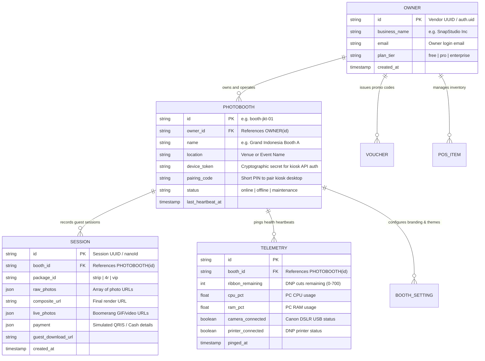
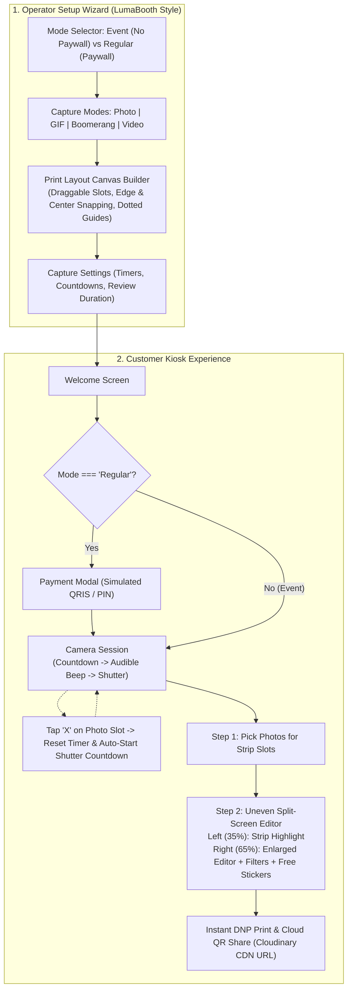

# QuickPic — The Grand Concept & Architecture

## 1. Executive Summary & Grand Vision
**QuickPic** is an intelligent, multi-tenant automated photobooth ecosystem built for photo entertainment vendors, event agencies, and permanent venues who manage **fleets of physical photobooths**. 

Combining reliable dedicated hardware (Canon DSLR cameras, DNP dye-sublimation photo printers) with modern web and cloud technologies (Next.js App Router, Tailwind CSS, Electron, Cloudinary, and relational cloud data with PostgreSQL/Supabase), QuickPic empowers a single **Owner (Vendor)** to configure, monitor, monetize, and remotely supervise multiple **Photobooth stations** across various venues from a unified dashboard.

Every subagent working on this codebase must align strictly with the principles and architectural boundaries established in this document.

---

## 2. Multi-Tenant Ecosystem Hierarchy

The architecture is modeled around a hierarchical, multi-tenant structure:

---

## 3. LumaBooth-Style Operator Setup & Kiosk Experience

### Core Experience Guidelines:
1. **Operator Setup (LumaBooth Style)**:
   - **Mode Selection**: Operator chooses **Event Mode** (free guest experience, zero paywall gatekeeping) or **Regular Mode** (monetized with simulated QRIS / cash bypass).
   - **Capture Modes**: Toggle active capture capabilities (**Photo**, **GIF**, **Boomerang**, **Video**).
   - **Interactive Print Layout Builder**: Full drag-and-drop canvas allowing the operator to position photo slots on the paper canvas.
     - **Snapping**: Snaps to Top, Bottom, Left, Right of adjacent slots, and snaps to Horizontal / Vertical center of the canvas.
     - **Visual Guides**: Spaced dotted lines appear on the canvas to indicate alignment lines in real-time.
   - **Capture Settings**: Configurable countdown seconds (e.g. 3–10s), delay between shots, and post-capture review time.
2. **Retake Auto-Reset & Auto-Start**:
   - When a guest clicks the 'x' button on an image slot during capture, the slot is cleared, and the countdown timer immediately resets and **auto-starts** the countdown sequence for the earliest empty slot without requiring additional button presses.
3. **Streamlined Slot Assignment & Removal of Zoom**:
   - Zoom/face framing controls are decommissioned to prevent awkward cropping.
   - Guests first select and map raw shots to strip slots, then proceed to the customization phase.
4. **Uneven Split-Screen Photo & Sticker Editor**:
   - **Left Panel (~35% width)**: Complete composite strip preview with visual highlighting around the active editing slot.
   - **Right Panel (~65% width)**: Enlarged active photo workspace with top toolbars for Filter selection and Sticker library.
   - **Free-Transform Stickers**: Stickers support free repositioning, scaling, and $360^\circ$ rotation handles.
5. **Universal Cloud QR Code Resolution**:
   - High-resolution composite images and Live Photo loops uploaded to Cloudinary CDN generate an externally accessible public URL (`https://quickpic-olive.vercel.app/gallery/[id]` or direct Cloudinary secure URL) so any mobile phone scanning the screen immediately loads the photo gallery.

---

## 4. Technology Stack & Database Selection

### Core Stack:
- **Frontend / Kiosk Application**: Next.js 16 (App Router), React 19, Tailwind CSS. Packaged for desktop kiosk operation via Electron.
- **Hardware Daemon**: Local Python daemon (`hardware-daemon/app.py` on port 8000) communicating with Canon EDSDK for cameras and local DNP printer drivers.
- **Media CDN**: Cloudinary for high-speed cloud asset storage, auto-optimizations, and mobile guest delivery.
- **Payment Processing**: **Frozen in Simulation Mode** (Dynamic QRIS simulation + Staff PIN bypass `1144`).
- **Database & Auth**: Firebase (Firebase Auth, Cloud Firestore, Firebase Storage) for multi-tenant relational persistence with hierarchical schema (`users/{userId}/outlets/{outletId}/events/{eventId}`) and offline `LocalStorage` buffering for physical kiosks.
- **Knowledge Engine**: Graphify (`graphify-out/graph.json`) for structured codebase memory.

---

## 5. Multi-Agent Team Responsibilities & Alignment

| Role | Domain | Primary Focus in Multi-Booth Vendor System |
|---|---|---|
| **1. Lead Engineer** | System Oversight & Governance | Architecture compliance, multi-tenant schema design, subagent orchestration. |
| **2. UI Engineer** | Visual Polish & Design System | LumaBooth setup wizard UI, interactive canvas layout builder with snapping, uneven split-screen editor, free-transform sticker layer. |
| **3. UX Engineer** | User Journey & Layout | State machine flow (Setup $\to$ Welcome $\to$ Capture $\to$ Slot Pick $\to$ Split Editor $\to$ Result), retake auto-start, touch ergonomics. |
| **4. Back-End Engineer** | APIs & Cloudinary | Public Cloudinary QR resolution, session saving, device pairing, and telemetry routes. |
| **5. Data Security Engineer** | Multi-Tenancy & Device Security | Event mode bypass validation, PostgreSQL RLS policies, kiosk device token gatekeeping. |
| **6. QA Engineer** | Code Quality & Unit Tests | Snapping algorithm unit tests, sticker rotation math tests, and QR link validation. |
| **7. QC Engineer** | Dynamic E2E & Browser Testing | End-to-end simulation of LumaBooth wizard, retake auto-start, split-screen editing, and mobile QR link opening. |
| **8. Research Analyst** | Market & Technology Intel | LumaBooth, Touchpix, and dslrBooth benchmark comparisons. |
| **9. Marketing Specialist** | Pricing & Growth Strategy | Event vs Regular package templates and promotional voucher rules. |
| **10. Finance Specialist** | Cost Control & Unit Economics | Consumables tracking (DNP paper/ribbon), Cloudinary usage limits, and margin control. |
